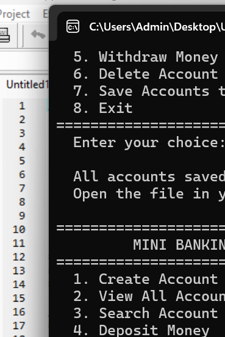
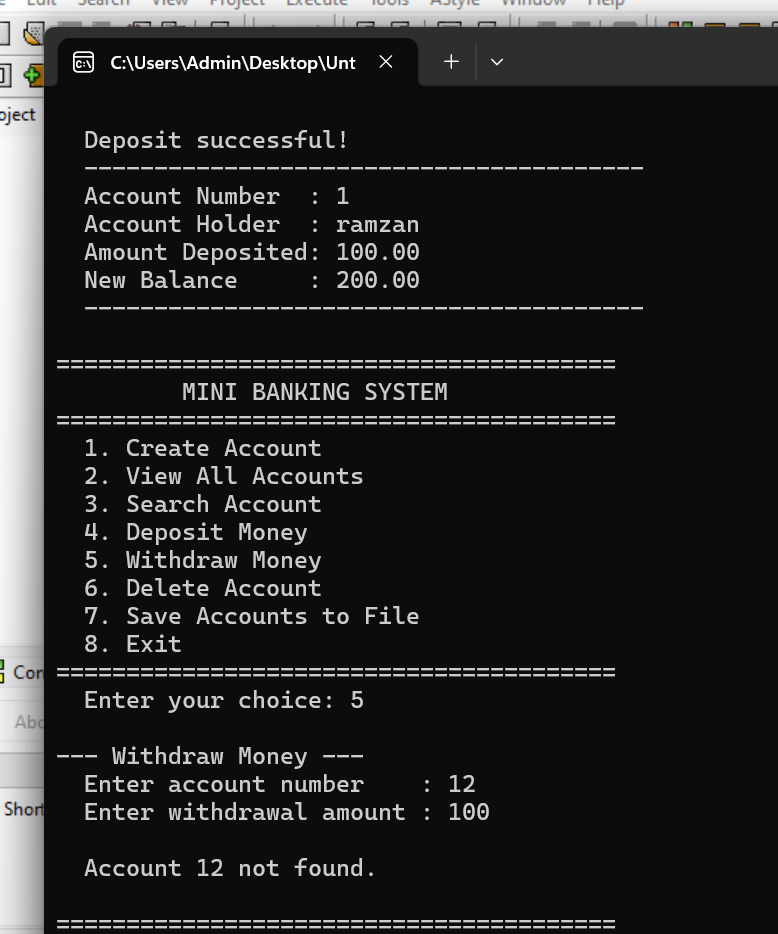

# Mini Banking System in C

A console-based mini banking system built in C. Create accounts, deposit and withdraw money, search records, delete accounts, and save everything to a file. The most complete data management project I have built so far.

---

## Screenshots





---

## Why I Built This

Every project in my portfolio introduces one or two new concepts on top of what I already know. This one introduced something that felt genuinely different — a program that makes financial decisions before modifying data.

In every previous project I could just update a value and move on. Here I had to check if the balance was sufficient before withdrawing. That one check changed how I think about writing functions. Validate first. Modify after. Never the other way around.

I also added a delete confirmation prompt for the first time — a Y/N check before removing any record permanently. Small detail. Big difference in how the program feels to use.

---

## What the Program Does

- Create account — stores account number, holder name, type, and opening balance
- View all accounts — displays a formatted table with all records
- Search account — finds and displays one account by number
- Deposit money — adds funds to an account with amount validation
- Withdraw money — subtracts funds only if balance is sufficient
- Delete account — removes a record with Y/N confirmation before deleting
- Save to file — writes all accounts to `accounts.txt`
- Exit — clean goodbye message

---

## How to Run It

**You need GCC installed. Check with:**
```bash
gcc --version
```

**Compile:**
```bash
gcc banking_system.c -o banking
```

**Run:**
```bash
./banking
```

After saving, an `accounts.txt` file appears in the same folder as the program.

---

## How I Built It — 6 Commit History

**Commit 1 — Project structure and menu**
Created `banking_system.c` and defined the `Account` struct with four fields — `accountNumber`, `name`, `type`, and `balance`. This was the first struct I built with two string fields. Set up the full 8-option menu with placeholders in all switch cases. Every option printed "Coming soon" — but the program ran from day one.

**Commit 2 — Create account**
Wrote `create_account()` with three validation layers before saving anything — account number must be positive, must be unique, and opening balance cannot be negative. Used `fgets()` for both name and type to handle spaces. This commit introduced a pattern I now use in every function: validate everything before touching the data.

**Commit 3 — View all accounts and search**
Wrote `view_accounts()` with a properly aligned table using `%-10s` and `%-25s` column formatting. Wrote `search_account()` which loops through the array, finds the account number, prints the full record, and breaks immediately — account numbers are unique so there is no reason to keep searching after the first match.

**Commit 4 — Deposit and withdrawal**
This was the most important commit. Wrote `deposit_money()` using `+=` to add to the balance directly in the struct. Wrote `withdraw_money()` with the key logic — check `amount > balance` before subtracting. If the check fails, print the available balance and the requested amount side by side. Only subtract if funds exist. This order — check then modify — matters.

**Commit 5 — Delete account and save to file**
Wrote `delete_account()` using the shift technique. Wrote `save_accounts()` with `fopen`, `fprintf`, and `fclose`. Every account is written to `accounts.txt` with the same formatting as the console output. Closing the file with `fclose` is not optional — without it the data may not be written correctly.

**Commit 6 — Improved input validation**
Added `is_valid_type()` using `strcmp()` to reject any account type that is not Savings or Current. Added `scanf` return value checks in every function — typing letters where numbers are expected no longer breaks the program. Added empty name check using `strlen()`. Added delete confirmation prompt — a Y/N check before any record is permanently removed. Added `MIN_BALANCE` and `MIN_AMOUNT` constants so minimum values are defined once and used everywhere.

---

## What I Learned

**Validate before modifying** — the withdrawal logic made this clear. Check if the operation is valid first. Only then change the data. This order is not optional in financial systems.

**`strcmp()` for string comparison** — you cannot compare strings with `==` in C. `strcmp(a, b)` returns `0` if they match. This was my first real use of `strcmp()` beyond just knowing it exists.

**`scanf` return value** — `scanf` returns the number of items successfully read. Checking `if (scanf(...) != 1)` catches letters typed where numbers are expected. Without this check the program enters an infinite loop on bad input. Every input function now checks this.

**Confirmation before deletion** — one Y/N prompt before a destructive action. Prevents data loss from accidental key presses. This pattern appears in every real application from terminals to banking apps.

**`is_valid_type()` helper function** — instead of repeating the same `strcmp` checks in multiple places, one small function handles it and returns 1 or 0. Clean and reusable.

**Two string fields in one struct** — `name` and `type` both as `char` arrays inside `Account`. Managing both with `fgets` and `strcspn` is now second nature.

---

## Project Structure

```
mini-banking-system-c/
├── banking_system.c
├── accounts.txt          ← generated when you save accounts
├── README.md
└── screenshots/
    ├── menu.png
    └── transactions.png
```

---

## Tech

- **Language:** C (C99)
- **Compiler:** GCC
- **Libraries:** `stdio.h`, `stdlib.h`, `string.h` — standard library only

---

## Connect

[](https://www.linkedin.com/in/muhammad-ramzan-bb63233aa/)
[](mailto:mramzan14700@gmail.com)

---

*Seventh project in my C portfolio. Most complete data management system so far — deposit, withdrawal, balance validation, file saving, and input hardening across 7 commits.*